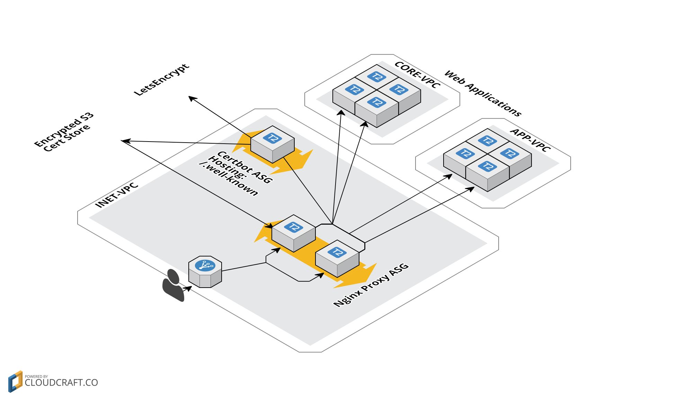

# LetsEncrypt Proxy

This module will create 2 auto-scaling groups one a LetsEncrypt "verification" ubuntu box and the other a HTTPS to HTTP/HTTPS proxy

## Overview diagram

This is in the [docs folder](docs).

